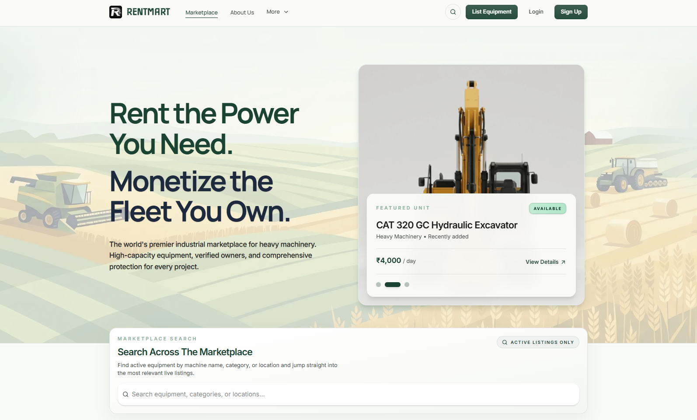
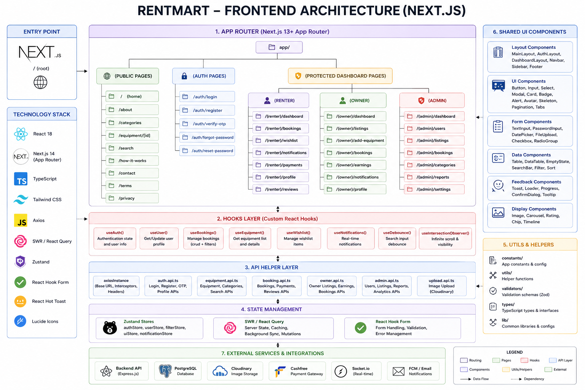
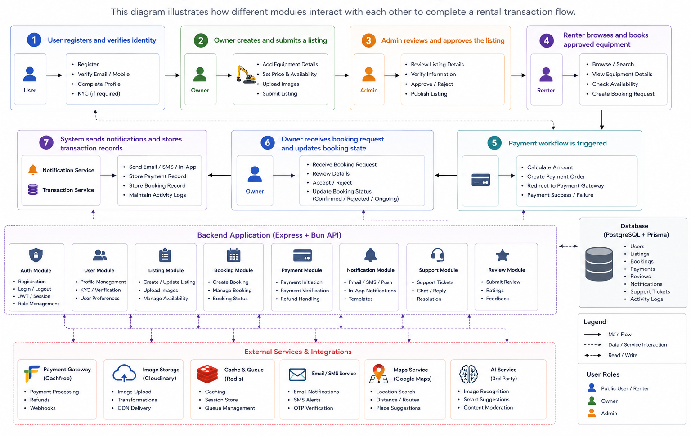
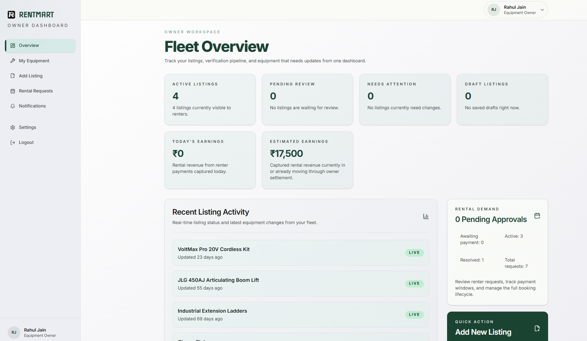
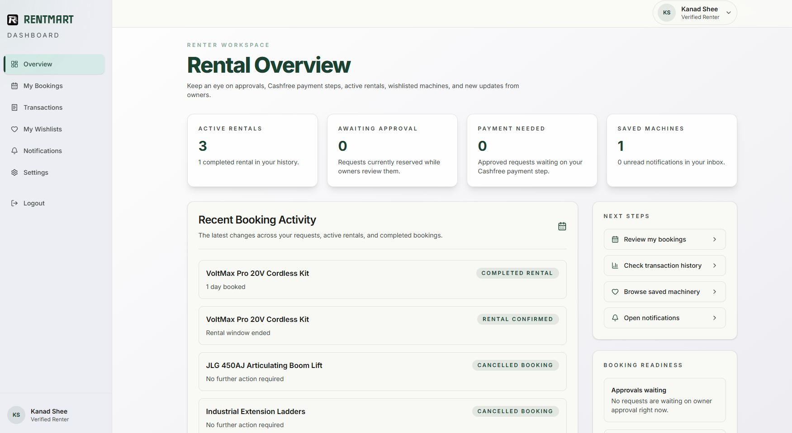
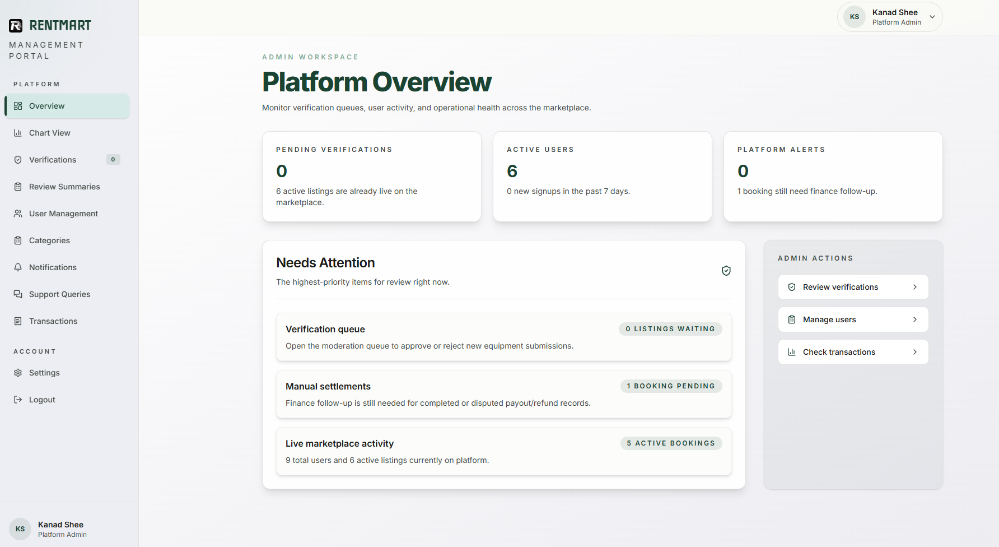

# RentMart

RentMart is the frontend application for a full-stack equipment rental marketplace. It provides the public marketplace experience, authentication pages, role-based dashboards, booking and wishlist workflows, support surfaces, payment visibility, and admin analytics for the RentMart platform.

The client is built with **Next.js 16**, **React 19**, **TypeScript**, **Tailwind CSS v4**, and **TanStack Query**. It communicates with the backend through feature-specific API hooks and local App Router proxy routes.



## Project Purpose

RentMart solves the problem of unorganized equipment rental by giving owners, renters, and administrators a single digital platform.

- Owners can list equipment, manage inventory, and respond to rental requests.
- Renters can browse equipment, view details, save listings, create bookings, and track activity.
- Admin users can verify listings, manage users/categories, inspect transactions, review support queries, and monitor platform health.
- The frontend presents these workflows through public pages, authenticated screens, and role-specific dashboards.
- The interface is designed to support academic project evaluation through clear modules, visible user flows, and complete full-stack integration.

## Key Features

- Public marketplace landing page with featured equipment and category-driven discovery.
- About, contact/support, terms, search, category, and equipment detail pages.
- Authentication screens for sign-in, sign-up, OTP verification, and logout flow.
- Role-aware dashboard routing for owner, renter, and admin users.
- Owner dashboard for listings, rental requests, settings, and transactions.
- Renter dashboard for bookings, wishlist, notifications, transactions, and profile activity.
- Admin dashboard for listing verification, users, categories, support queries, transactions, and charts.
- Wishlist support for saving equipment before booking.
- Notification screens for booking, listing, and account-related updates.
- Payment and transaction visibility through dashboard pages.
- Support query submission from the contact page and admin-side review.
- Review and summary support for completed equipment rental experiences where the backend exposes review data.
- Responsive layouts for desktop and mobile screen sizes.
- Reusable UI, hooks, and API helpers for maintainable development.

## Technology Stack

| Layer         | Technology                 | Usage in Client                                          |
| ------------- | -------------------------- | -------------------------------------------------------- |
| Framework     | Next.js 16 App Router      | Page routing, layouts, route groups, and proxy routes    |
| UI library    | React 19                   | Component-based marketplace and dashboard UI             |
| Language      | TypeScript                 | Safer props, API types, and domain models                |
| Styling       | Tailwind CSS v4            | Responsive utility-first styling                         |
| Server state  | TanStack Query             | Fetching, caching, mutations, and revalidation           |
| Forms         | React Hook Form            | Auth, listing, support, and settings forms               |
| Validation    | Zod + resolvers            | Client-side form validation                              |
| Icons         | lucide-react               | Dashboard, navigation, action, and status icons          |
| Motion        | motion                     | Page transitions, interactive polish, and reveal effects |
| Charts        | Recharts                   | Admin analytics and visual reporting                     |
| UI primitives | Base UI + local components | Reusable accessible interface building blocks            |
| Utilities     | clsx, tailwind-merge, CVA  | Class composition and variant handling                   |

## Application Structure

```text
client/
├─ public/
│  └─ assets/
├─ src/
│  ├─ app/
│  ├─ components/
│  ├─ hooks/
│  ├─ lib/
│  ├─ providers/
│  └─ utils/
├─ components.json
├─ next.config.ts
├─ package.json
└─ tsconfig.json
```

## Frontend Architecture

The frontend follows a modular architecture based on the Next.js App Router. User requests are routed through pages and layouts, where reusable UI components, feature-specific hooks, and API utilities work together to fetch data from the backend and render responsive interfaces. This layered architecture promotes maintainability, code reusability, and clear separation of concerns.



## Module Interaction Flow

The following diagram illustrates how a user interacts with the RentMart frontend. Requests pass through the App Router, reusable components, React Query hooks, API utilities, and proxy routes before reaching the backend. Responses are cached, processed, and rendered as interactive user interfaces.



## Important Directories

- `src/app`
  - Contains App Router pages, layouts, route groups, protected routes, public pages, and local API proxy routes.
- `src/app/(public-pages)`
  - Contains public-facing marketplace pages such as about, contact, terms, search, category, and details.
- `src/app/(auth)`
  - Contains sign-in, sign-up, and OTP verification pages.
- `src/app/(protected)`
  - Contains dashboard and protected product/user workflows.
- `src/app/(api)`
  - Contains Next.js proxy routes for auth, bookings, categories, equipment, notifications, payments, support queries, and wishlists.
- `src/components`
  - Contains shared UI, feature components, dashboard pieces, cards, forms, navigation, and reusable page sections.
- `src/hooks`
  - Contains feature-specific TanStack Query hooks such as auth, bookings, equipment, category, notifications, payments, support query, and wishlist.
- `src/lib`
  - Contains API clients, HTTP helpers, types, constants, and shared utilities.
- `public/assets`
  - Contains screenshots, design references, and static assets used for marketplace and dashboard screens.

## Route and Page Coverage

- `/`
  - Public marketplace landing page.
- `/about`
  - Project/company information page.
- `/contact`
  - Contact and support query submission page.
- `/terms`
  - Terms of service page.
- `/search`
  - Equipment search and browsing page.
- `/category/[categoryId]`
  - Category-specific equipment listing page.
- `/details/[id]`
  - Single equipment detail page.
- `/sign-in`
  - User login page.
- `/sign-up`
  - User registration page.
- `/verify-otp`
  - OTP verification page.
- `/dashboard`
  - Protected role-based dashboard entry point.
- `/dashboard/...`
  - Admin, owner, renter, and shared dashboard sections.

## User Role Workflows

### Public Visitor

- Browse the RentMart landing page.
- Explore equipment categories and featured listings.
- Open equipment detail pages.
- Read about, terms, and contact/support pages.
- Move into authentication when booking or saving equipment is required.

### Renter

- Sign up and verify account details.
- Search and compare available equipment.
- Save equipment to wishlist for later.
- Submit booking requests.
- Track booking status and notifications.
- View transaction-related dashboard information.
- Submit support queries when help is needed.

### Owner

- Sign up and access protected owner dashboard.
- Create and manage equipment listings.
- Upload listing information and images.
- Track listing verification state.
- Accept or reject rental requests.
- View transaction and booking activity.
- Update settings and respond to platform notifications.

### Admin

- Review and verify submitted listings.
- Manage users and categories.
- Inspect support queries from owners and renters.
- Monitor booking/payment activity.
- View raw payment events and transaction records.
- Use chart view for platform-level operational insights.

## Client-Server Integration

The client is designed around clear communication with the backend API.

- `src/lib` provides shared request helpers and typed API utilities.
- `src/hooks/use-auth.ts` handles authentication and session-related state.
- `src/hooks/use-equipment.ts` handles public listings, owner listings, and admin equipment views.
- `src/hooks/use-category.ts` handles category data.
- `src/hooks/use-bookings.ts` handles booking creation, approval, rejection, and lifecycle state.
- `src/hooks/use-wishlist.ts` handles saved equipment.
- `src/hooks/use-notification.ts` handles user notification feeds.
- `src/hooks/use-support-query.ts` handles support form submission and admin review data.
- `src/hooks/use-payments.ts` supports payment and raw event visibility.
- App Router proxy routes under `src/app/(api)` forward expected API requests to the server boundary.

## Dashboard and Analytics

The dashboard is one of the most important evaluation areas because it demonstrates role separation and admin governance.

- Owner dashboard focuses on inventory and rental request management.
  
- Renter dashboard focuses on bookings, saved items, alerts, and transaction visibility.
  
- Admin dashboard focuses on platform supervision and verification.
  
- Chart view summarizes marketplace health using Recharts.
- Analytics include payment trends, booking flow, support load, user mix, verification status, and settlement-related information.
- Dashboard screens are built from reusable components so the UI remains consistent across roles.

## Security-Aware Frontend Practices

The frontend does not replace backend security, but it follows safe client patterns.

- Protected pages are grouped separately from public pages.
- Auth-sensitive requests use shared HTTP utilities instead of scattered manual fetch calls.
- API proxy routes keep backend communication centralized.
- Forms use validation before submission.
- Role-specific views reduce accidental access to irrelevant workflows.
- API errors are normalized for predictable UI feedback.
- File and image form data is preserved where upload flows require it.
- Payment-related backend failures are handled through controlled UI states instead of broken screens.

## Environment Setup

Create the required environment file for local API communication. The exact variable names may depend on the backend configuration, but the client should know the server/API base URL used by the proxy and hooks.

Common setup points:

- Install Bun.
- Install project dependencies.
- Make sure the server is running before testing authenticated or data-driven pages.
- Configure the API/backend URL expected by the client.
- Keep credentials and secrets outside source control.

## Local Development

```bash
bun install
bun run dev
```

Then open:

```text
http://localhost:3000
```

## Build and Production Run

```bash
bun run build
bun run start
```

## Code Quality Commands

```bash
bun run lint
bun run format:check
bun run format:fix
```

## Evaluation Highlights

- Full-stack marketplace client with public, protected, and admin-facing pages.
- Clear role-based user experience for owner, renter, and admin.
- Modern App Router architecture with grouped routes.
- Feature-specific React Query hooks for maintainable API state.
- Structured forms and validation for important workflows.
- Dashboard analytics and transaction visibility for evaluation depth.
- Responsive UI with reusable components and marketplace-specific screens.
- Strong alignment with the project report modules: authentication, listings, categories, bookings, payments, notifications, support, wishlist, and reviews/summary.

## Contributor Notes

- Reuse hooks from `src/hooks` before adding new fetch logic.
- Keep public pages, protected pages, and API proxy routes in their existing route groups.
- Keep shared UI inside `src/components` and domain logic inside `src/lib` or hooks.
- Use existing Tailwind, Base UI, and local component patterns for consistency.
- Update this README when new evaluation-visible pages, dashboard modules, or scripts are added.

